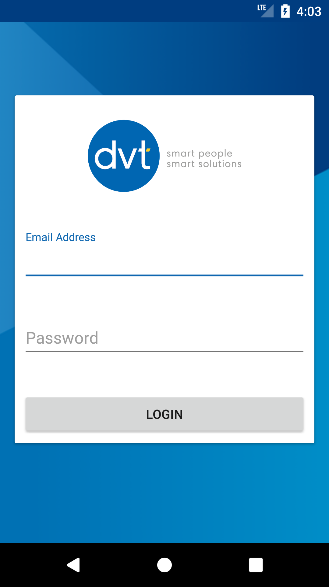

# Showcase Android App

Showcase is an android application where you can display the work you have done as a company or an individual.

The app has a list of applications that are displayed (and looks very similar to a play store).

You can view the apps details and some screenshots of the application.

You can also view some information about the company that has developed the apps.

# Technologies used
- Firebase
- Android
- Kotlin
- RxJava
- Android Architecture Components

# Screenshots

Here are some screenshots from the application. 

